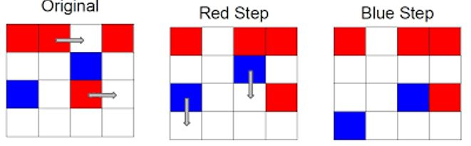

## **Problem definition and Requirements**

The Red/Blue computation simulates two interactive flows: a N by N board is initialized so cells have one of three colors: red, white, and blue, where white is empty. In each move/iteration, the red moves 1 step **right** and the blue moves 1 step down. At the end of the row/column, the color wraps around to the beginning. 

In the program, below numbers are used to represent each of the cell color in a 2-D Array: 

- white = 0; red = 1; blue = 2; red or blue just moved in = 3;
- red or blue (in the first row or column) just moved out = 4;

A typical array representation of the below sample is shown underneath: 

| 1 1 0 1   | 1 0 1 (3)1 | 1 0 1 1    |
|---------- |------------|------------|
| 0 0 2 0   | 0 0 2 0    | 0 0 0 0    |
| 2 0 1 0   | 2 0 0 (3)1 | 0 0 (3)2 1 |
| 0 0 0 0   | 0 0 0 0    | (3)2 0 0 0 |